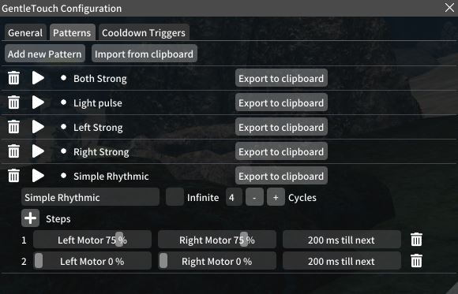
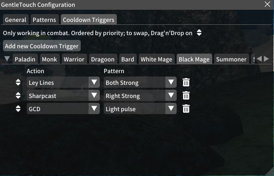

# GentleTouch

A Final Fantasy XIV Quicklauncher (XIVLauncher) plugin.
Allows one to create vibration patterns for the controller and specify triggers for them.

Licensed under AGPLv3 or later.

## Features

- Create different vibration patterns
- Add cooldown triggers to perform patterns when its safe to activate the cooldown again
- Aether currents can be sensed via vibration when out-of-combat.

